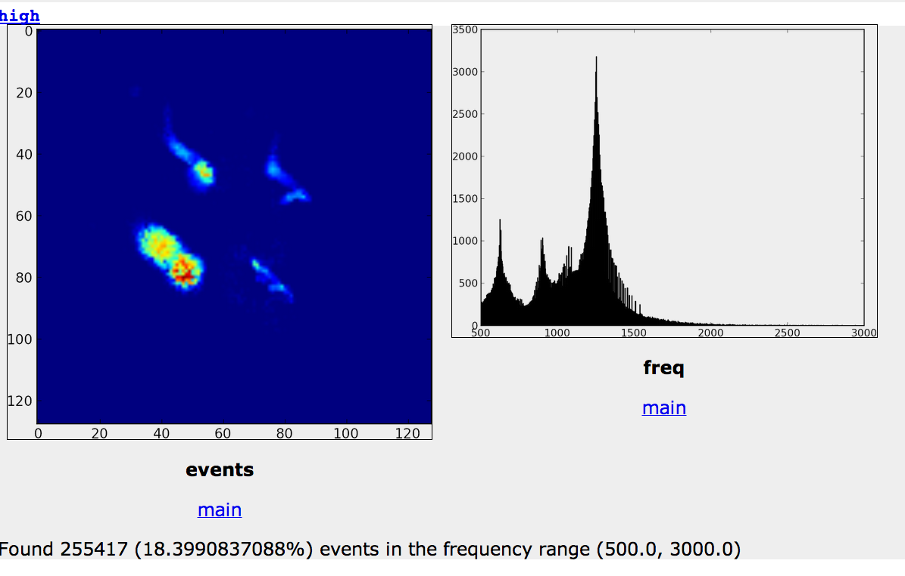

# Low-latency localization by Active LED Markers tracking using a Dynamic Vision Sensor

This repository contains the source code 
for a Python implementation of the method
contained in the paper *Low-latency localization by Active LED Markers tracking using a Dynamic Vision Sensor*
(in the spirit of *reproducible research*).
The paper's PDF, slides, and other additional materials are found [on this webpage][webpage].

[webpage]: http://purl.org/censi/2013/dvs

## Step 1: Setting up the development environment

The Python source code for the method is contained in the [``rcl`` repository](https://github.com/AndreaCensi/env_dvs). Note, however, that there are a bunch of dependences  across a bunch of repositories
(on the ``env_dvs`` branch). 

[See here for instructions on how to setup the development environment](README-development.md).

##  Step 2: Downloading example dataset

The next step is downloading the example dataset from

  <http://censi.mit.edu/pub/1212-DVS-data/>

For example, you can use the command

    $ wget -m -L http://censi.mit.edu/pub/1212-DVS-data/

##  Step 3: Running the code

At this point you should have completed the two steps above, which means:

1) You have downloaded the directory ``1212-DVS-data``
2) You have an ``environment.sh`` file created during the setup.

Now, setup the environment using:

    $ source environment.sh

And make sure that the executables are correctly installed. For example:

    # check "aer_video" exists
    $ which aer_video 
    <your path>/deploy/bin/aer_video

### Creating videos of the event data

Use this to create a video of a .aedat file with slices = 0.03 seconds:

    aer_video  --log 1212-DVS-data/data/dec10/flying/l11.aedat -o tmp-videos --interval 0.03  -c make

You can create videos using different intervals for the slice by giving more 
arguments to ``--interval``. Note the [Compmake][compmake] ``parmake`` argument to
``-c`` which makes the computation run in parallel (if you have multiple processors).

    aer_video  --log 1212-DVS-data/data/dec10/flying/l2.aedat -o videos2 --interval 0.03 0.01 0.001 -c parmake

[compmake]: http://andreacensi.github.io/compmake/

    

### Other simple stats about the data

There are a bunch of commands that display some simple statistics
of the data. These are most useful as simple code examples to read through.

The command ``aer_stats_events`` displays some simple spatial statistics:

    $ aer_stats_events -o events2 --log data/nov23/detail_2.aedat -c "clean;make"

<!--The command ``aer_simple_stats` displays ...

$ aer_simple_stats -o simple2 --log data/dec10/flying/l2.aedat -->

The command ``aer_stats_freq` displays the transition frequencies detected in a log.

    $ aer_stats_freq -o freq1 --log data/dec10/flying/l2.aedat 

The following is the output, which shows the dominant frequencies 
corresponding to the different LEDs.

### Running the detection algorithm

The configuration is a bit clunky. You should have on the current directory the
``aer_blink_conf.yaml`` file found in the ``rcl`` repository. This file 
contains the frequencies to use for each log. 

This runs the detector on the file ``data/dec6/l1.aedat``

    $ aer_blink_detect -o l2 -c make --suffix i02p3d15 --log data/dec6/l2.aedat --interval 0.002 --npeaks 3 --min_led_distance 15

The method parameters are:

- ``interval``: Interval to use (s). This is the latency of the method.
- ``npeaks``: Number of peaks to detect.
- ``min_led_distance``: Minimum distance between different LEDs (pixels).

The other parameters have to do with the computation and visualization:

- ``--log <log1> ... <log n>``: logs to work on
- ``-o <dir>``: indicates the output directory
- ``-suffix <string>``: gives a string that indicates this configuration
- ``-c <compmake commands>``: A [Compmake][compmake] command (try: ``make`` or ``parmake``)

    

